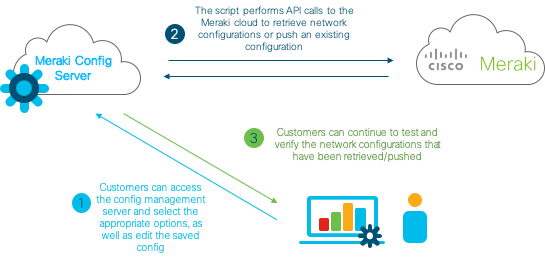
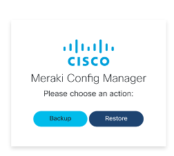
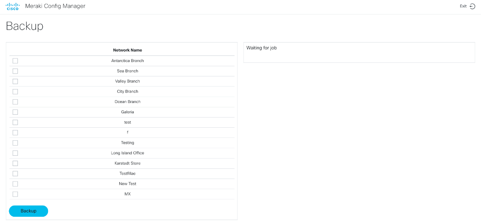
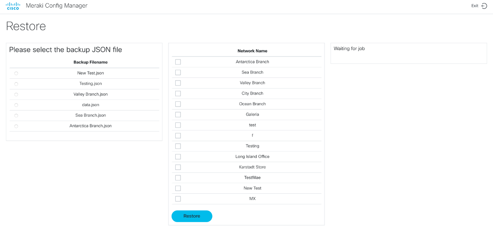

# Meraki Config Manager
This is the Meraki Config Manager source code. Using the Meraki Dashboard API and Flask, we have developed an application
that can provide a simple way to backup and restore Meraki settings into a file. This file can then be edited by network teams 
to suit the needs of the Meraki network.



## Contacts

* Josh Ingeniero (jingenie@cisco.com)
* Monica Acosta (moacosta@cisco.com)

## Solution Components
* Python
* Flask
* Meraki Dashboard API
* Meraki MR Access Points
* Meraki MX Gateways
* Meraki MS Switches

## Installation:

#### Clone the repo
```
$ git clone https://github.com/gve-sw/meraki-config-manager.git
```

#### Set up a Python venv
First make sure that you have Python 3 installed on your machine. We will then be using venv to create 
an isolated environment with only the necessary packages.

##### Install virtualenv via pip
```
$ pip install virtualenv
```

##### Create a new venv
```
Change to your project folder
$ cd meraki-config-manager

Create the venv
$ virtualenv venv

Activate your venv
$ source venv/bin/activate
```

#### Install dependencies
```
$ pip install -r requirements.txt
```

## Setup:
#### Meraki details :
You can deploy this prototype in a lab environment or on your own Meraki dashboard online
[here](https://account.meraki.com/secure/login/dashboard_login).

To generate an API KEY, refer to the documentation [here](https://documentation.meraki.com/zGeneral_Administration/Other_Topics/The_Cisco_Meraki_Dashboard_API#Enable_API_access).
You will use this for getting an ORGANIZATION ID, and using this application.

You must select an organization to manage and use its ORGANIZATION ID. You may do so by using Meraki's Postman collection
[here](https://documenter.getpostman.com/view/7928889/SVmsVg6K#18e62fd9-402a-4768-ab5e-f11a44651cfe) and GET the list of organizations,
or use Meraki's API Docs to generate a request [here](https://developer.cisco.com/meraki/api-v1/#!get-organizations).

Fill in the details of your Meraki deployment in the [DETAILS.py](DETAILS.py) file
```python

MERAKI_API_KEY = 'YOUR MERAKI API KEY'
MERAKI_ORGANIZATION_ID = 'YOUR MERAKI ORG ID'

```

## Usage:
Launch the config script. Make sure that you have your venv activated.
```commandline
$ flask run --port=5000
```

#### Running
Launch your web browser and navigate to [localhost:5000](localhost:5000) or with your configured port.

You will be asked whether to backup or restore configs



#### Backup
The Backup Page will allow you to select the networks you would like to backup. These will then be saved as .json files in the [configs](configs) folder of the app



#### Backup structure
After back up, data will be stored in [data.json](configs/data.json) in the configs folder with the following JSON format
```json
{
    "mx_l7_firewall": {
        "rules": [
            {
                "policy": "deny",
                "type": "host",
                "value": "yahoo.com"
            },
            {
                "policy": "deny",
                "type": "application",
                "value": {
                    "id": "meraki:layer7/application/189",
                    "name": "Blizzard"
                }
            },
            {
                "policy": "deny",
                "type": "applicationCategory",
                "value": {
                    "id": "meraki:layer7/category/9",
                    "name": "Social web & photo sharing"
                }
            }
        ]
    },
    "mx_1_1_nat_rules": {
        "rules": [
            {
                "name": "Testing",
                "publicIp": "101.3.1.5",
                "lanIp": "192.168.128.3",
                "uplink": "internet1",
                "allowedInbound": []
            },
            {
                "name": "testing2",
                "publicIp": "101.3.1.6",
                "lanIp": "192.168.128.5",
                "uplink": "internet1",
                "allowedInbound": []
            }
        ]
    },
    "wireless_settings": {
        "meshingEnabled": true,
        "ipv6BridgeEnabled": true,
        "locationAnalyticsEnabled": true,
        "ledLightsOn": true
    },
    "ssids": [
        {
            "number": 0,
            "name": "Testing - wireless WiFi",
            "enabled": true,
            "splashPage": "None",
            "ssidAdminAccessible": false,
            "authMode": "open",
            "ipAssignmentMode": "NAT mode",
            "minBitrate": 11,
            "bandSelection": "Dual band operation",
            "perClientBandwidthLimitUp": 0,
            "perClientBandwidthLimitDown": 0,
            "visible": true,
            "availableOnAllAps": true,
            "availabilityTags": []
        },
        {
            "number": 1,
            "name": "Testing 2 SSID 2",
            "enabled": true,
            "splashPage": "None",
            "ssidAdminAccessible": false,
            "authMode": "open",
            "ipAssignmentMode": "NAT mode",
            "minBitrate": 11,
            "bandSelection": "Dual band operation",
            "perClientBandwidthLimitUp": 0,
            "perClientBandwidthLimitDown": 0,
            "visible": true,
            "availableOnAllAps": true,
            "availabilityTags": []
        },
        {
            "number": 2,
            "name": "testing 3 SSID 3",
            "enabled": false,
            "splashPage": "None",
            "ssidAdminAccessible": false,
            "authMode": "open",
            "ipAssignmentMode": "NAT mode",
            "minBitrate": 11,
            "bandSelection": "Dual band operation",
            "perClientBandwidthLimitUp": 0,
            "perClientBandwidthLimitDown": 0,
            "visible": true,
            "availableOnAllAps": true,
            "availabilityTags": []
        },
        {
            "number": 3,
            "name": "new testing SSID 4",
            "enabled": false,
            "splashPage": "None",
            "ssidAdminAccessible": false,
            "authMode": "open",
            "ipAssignmentMode": "NAT mode",
            "minBitrate": 11,
            "bandSelection": "Dual band operation",
            "perClientBandwidthLimitUp": 0,
            "perClientBandwidthLimitDown": 0,
            "visible": true,
            "availableOnAllAps": true,
            "availabilityTags": []
        },
        {
            "number": 4,
            "name": "Unconfigured SSID 5",
            "enabled": false,
            "splashPage": "None",
            "ssidAdminAccessible": false,
            "authMode": "open",
            "ipAssignmentMode": "NAT mode",
            "minBitrate": 11,
            "bandSelection": "Dual band operation",
            "perClientBandwidthLimitUp": 0,
            "perClientBandwidthLimitDown": 0,
            "visible": true,
            "availableOnAllAps": true,
            "availabilityTags": []
        },
        {
            "number": 5,
            "name": "Unconfigured SSID 6",
            "enabled": false,
            "splashPage": "None",
            "ssidAdminAccessible": false,
            "authMode": "open",
            "ipAssignmentMode": "NAT mode",
            "minBitrate": 11,
            "bandSelection": "Dual band operation",
            "perClientBandwidthLimitUp": 0,
            "perClientBandwidthLimitDown": 0,
            "visible": true,
            "availableOnAllAps": true,
            "availabilityTags": []
        },
        {
            "number": 6,
            "name": "Unconfigured SSID 7",
            "enabled": false,
            "splashPage": "None",
            "ssidAdminAccessible": false,
            "authMode": "open",
            "ipAssignmentMode": "NAT mode",
            "minBitrate": 11,
            "bandSelection": "Dual band operation",
            "perClientBandwidthLimitUp": 0,
            "perClientBandwidthLimitDown": 0,
            "visible": true,
            "availableOnAllAps": true,
            "availabilityTags": []
        },
        {
            "number": 7,
            "name": "Unconfigured SSID 8",
            "enabled": false,
            "splashPage": "None",
            "ssidAdminAccessible": false,
            "authMode": "open",
            "ipAssignmentMode": "NAT mode",
            "minBitrate": 11,
            "bandSelection": "Dual band operation",
            "perClientBandwidthLimitUp": 0,
            "perClientBandwidthLimitDown": 0,
            "visible": true,
            "availableOnAllAps": true,
            "availabilityTags": []
        },
        {
            "number": 8,
            "name": "Unconfigured SSID 9",
            "enabled": false,
            "splashPage": "None",
            "ssidAdminAccessible": false,
            "authMode": "open",
            "ipAssignmentMode": "NAT mode",
            "minBitrate": 11,
            "bandSelection": "Dual band operation",
            "perClientBandwidthLimitUp": 0,
            "perClientBandwidthLimitDown": 0,
            "visible": true,
            "availableOnAllAps": true,
            "availabilityTags": []
        },
        {
            "number": 9,
            "name": "Unconfigured SSID 10",
            "enabled": false,
            "splashPage": "None",
            "ssidAdminAccessible": false,
            "authMode": "open",
            "ipAssignmentMode": "NAT mode",
            "minBitrate": 11,
            "bandSelection": "Dual band operation",
            "perClientBandwidthLimitUp": 0,
            "perClientBandwidthLimitDown": 0,
            "visible": true,
            "availableOnAllAps": true,
            "availabilityTags": []
        },
        {
            "number": 10,
            "name": "Unconfigured SSID 11",
            "enabled": false,
            "splashPage": "None",
            "ssidAdminAccessible": false,
            "authMode": "open",
            "ipAssignmentMode": "NAT mode",
            "minBitrate": 11,
            "bandSelection": "Dual band operation",
            "perClientBandwidthLimitUp": 0,
            "perClientBandwidthLimitDown": 0,
            "visible": true,
            "availableOnAllAps": true,
            "availabilityTags": []
        },
        {
            "number": 11,
            "name": "Unconfigured SSID 12",
            "enabled": false,
            "splashPage": "None",
            "ssidAdminAccessible": false,
            "authMode": "open",
            "ipAssignmentMode": "NAT mode",
            "minBitrate": 11,
            "bandSelection": "Dual band operation",
            "perClientBandwidthLimitUp": 0,
            "perClientBandwidthLimitDown": 0,
            "visible": true,
            "availableOnAllAps": true,
            "availabilityTags": []
        },
        {
            "number": 12,
            "name": "Unconfigured SSID 13",
            "enabled": false,
            "splashPage": "None",
            "ssidAdminAccessible": false,
            "authMode": "open",
            "ipAssignmentMode": "NAT mode",
            "minBitrate": 11,
            "bandSelection": "Dual band operation",
            "perClientBandwidthLimitUp": 0,
            "perClientBandwidthLimitDown": 0,
            "visible": true,
            "availableOnAllAps": true,
            "availabilityTags": []
        },
        {
            "number": 13,
            "name": "Unconfigured SSID 14",
            "enabled": false,
            "splashPage": "None",
            "ssidAdminAccessible": false,
            "authMode": "open",
            "ipAssignmentMode": "NAT mode",
            "minBitrate": 11,
            "bandSelection": "Dual band operation",
            "perClientBandwidthLimitUp": 0,
            "perClientBandwidthLimitDown": 0,
            "visible": true,
            "availableOnAllAps": true,
            "availabilityTags": []
        },
        {
            "number": 14,
            "name": "Unconfigured SSID 15",
            "enabled": false,
            "splashPage": "None",
            "ssidAdminAccessible": false,
            "authMode": "open",
            "ipAssignmentMode": "NAT mode",
            "minBitrate": 11,
            "bandSelection": "Dual band operation",
            "perClientBandwidthLimitUp": 0,
            "perClientBandwidthLimitDown": 0,
            "visible": true,
            "availableOnAllAps": true,
            "availabilityTags": []
        }
    ],
    "switch_port_schedules": [
        {
            "id": "698057942242427297",
            "networkId": "L_698057942242442827",
            "name": "Testing",
            "portSchedule": {
                "monday": {
                    "active": true,
                    "from": "00:00",
                    "to": "24:00"
                },
                "tuesday": {
                    "active": true,
                    "from": "00:00",
                    "to": "24:00"
                },
                "wednesday": {
                    "active": true,
                    "from": "00:00",
                    "to": "24:00"
                },
                "thursday": {
                    "active": true,
                    "from": "00:00",
                    "to": "24:00"
                },
                "friday": {
                    "active": true,
                    "from": "00:00",
                    "to": "24:00"
                },
                "saturday": {
                    "active": true,
                    "from": "00:00",
                    "to": "24:00"
                },
                "sunday": {
                    "active": true,
                    "from": "00:00",
                    "to": "24:00"
                }
            }
        }
    ],
    "switch_acls": [
        {
            "comment": "test",
            "policy": "deny",
            "ipVersion": "ipv4",
            "protocol": "tcp",
            "srcCidr": "10.0.0.1/32",
            "srcPort": "any",
            "dstCidr": "any",
            "dstPort": "any",
            "vlan": "any"
        }
    ]
}
```

#### Restore
The Restore Page will allow you to choose from existing backup .json files the [configs](configs) folder, and select which networks it should restore




#### Adding new configs
Currently, the code supports backing up and restoring the following configurations:
* MX L7 Firewall Rules
* MX 1-to-1 NAT Rules
* Wireless Settings
* Switch ACLs
* Switch Port Schedules
* AMP Settings - _if applicable_

In [backup.py](./backup.py), you are able to modify the backup and restore functions to add additional
configurations that you may want to use. You may visit the [Meraki Dashboard API Docs](https://developer.cisco.com/meraki/api/)
for more information.

## License
Provided under Cisco Sample Code License, for details see [LICENSE](./LICENSE.txt)

## Code of Conduct
Our code of conduct is available [here](./CODE_OF_CONDUCT.md)

## Contributing
See our contributing guidelines [here](./CONTRIBUTING.md)
